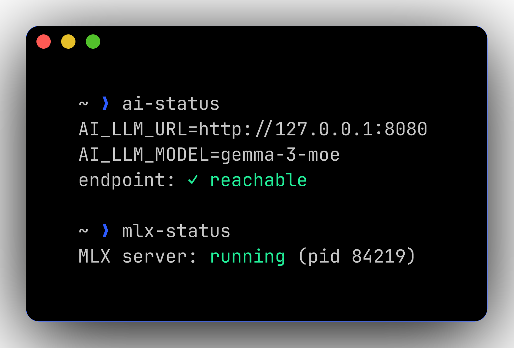

<div align="center">

# 🌃 dotfiles

**A neon-cobalt + magenta development environment for macOS.**
Reproducible from one script. Themed end-to-end across nvim, tmux, starship, lazygit, fzf, and bat.

[](#)
[](#-color-palette)
[](https://www.lazyvim.org)
[](https://starship.rs)
[](https://ohmyz.sh)


</div>

---

## 📑 Table of contents

- [Quick start](#-quick-start)
- [What you get](#-what-you-get)
- [The prompt — full reference](#-the-prompt--full-reference)
  - [Anatomy](#anatomy)
  - [Segment reference & toggles](#segment-reference--toggles)
  - [Adding/removing segments](#adding--removing-segments-from-the-prompt)
  - [Recipes](#recipes)
- [Color palette](#-color-palette)
- [Modern CLI stack](#-modern-cli-stack)
- [fzf shortcuts](#-fzf-shortcuts)
- [Neovim](#-neovim)
- [Local AI in Neovim](#-local-ai-in-neovim)
- [Tmux](#-tmux)
- [Colima — Docker/k8s on demand](#-colima--dockerk8s-on-demand)
- [Documentation site (mkdocs)](#-documentation-site-mkdocs)
- [Git workflow](#-git-workflow)
- [Repository layout](#-repository-layout)
- [Install script reference](#-install-script-reference)
- [Secrets](#-secrets)
- [Caveats & gotchas](#-caveats--gotchas)

---

## 🚀 Quick start

```bash
git clone git@github.com:<your-user>/dotfiles.git ~/.dotfiles
cd ~/.dotfiles
./install.sh
```

Then:
1. Set your terminal (cmux/Ghostty/iTerm2) font to **JetBrainsMono Nerd Font** (already brewed)
2. Open a fresh shell — `exec zsh`
3. Drop secrets in `~/.zshrc.local` (see [Secrets](#-secrets))

The installer handles symlinks, brews, oh-my-zsh, plugins, fzf bindings, tmux plugins (headless), Neovim plugins (headless), and Mason LSPs.

---

## 🎁 What you get

<table>
<tr>
<td width="50%" valign="top">

### 🧰 Tools

- 🐚 **zsh** + oh-my-zsh + starship
- ⚡ **fzf** + fzf-tab + zsh-autosuggestions
- 🪟 **tmux** w/ TPM (sessions auto-restore)
- 📝 **Neovim** (LazyVim) — Go, K8s/YAML, Docker, AI
- 🐙 **lazygit** — TUI git client
- 🤖 **CodeCompanion** — local AI via MLX or LM Studio

</td>
<td width="50%" valign="top">

### 🦾 Modern CLI replacements

- `ls` → **eza** (icons + git status)
- `cat` → **bat** (syntax + paging)
- `grep` → **ripgrep** (`rg`)
- `find` → **fd**
- `cd` → **zoxide** (`j foo`)
- `git diff` → **delta** (side-by-side)
- `top` → **btop** · `du` → **dust**
- `man` → **tldr** (tealdeer)

</td>
</tr>
</table>

---

## 💎 The prompt — full reference

A 3-line cobalt + magenta starship prompt with right-aligned battery + clock. Every segment is contextual: it only shows when it has something useful to say.

> 📸 **Rich context** — git repo with dirty status, active k8s context, Azure subscription, Python venv, slow command:
>
> 
>
> *(In the screenshot, `(dir)`/`(branch)`/`[k8s]`/`[az]`/`(py)`/`[bat]`/`[time]` stand in for Nerd Font glyphs that the screenshot generator can't render. Your actual terminal shows the real glyphs ` `, ` `, `⎈`, `󰠅`, ` `, `󰁹`, ` `.)*

> 📸 **Failure state** — last command exited non-zero:
>
> 

> 📸 **Minimal context** — fresh shell, no git/k8s/azure, instant command:
>
> ```
> ╭─  ~
> │
> ╰─❯ █
> ```

### Anatomy

```
   ┌── Line 1 ─────────────────────────────────────────────────────┐
╭─  ~/work/dotfiles   on   main !8 ?15           🐳   [bat]  [time]
   │                  │    │                      │      │     │
   │                  │    └─ git_branch + status │      │     └─ time
   │                  └─ "on" literal             │      └─ battery
   │                                              └─ colima (🐳 if running)
   └─ directory
   ┌── Line 2 ─────────────────────────────────────────────────────┐
│  ⎈ aks-prod (default)  󰠅 Armada-Prod   3.12.1 (venv)  took 4s
│   │                    │              │              │
│   └─ kubernetes        │              │              └─ cmd_duration
│                        │              └─ python
│                        └─ azure
   ┌── Line 3 ─────────────────────────────────────────────────────┐
╰─❯
   └─ character
```

**Edit the prompt** at [`zsh/starship.toml`](zsh/starship.toml). Reload by opening a new shell.
**Live-tweak** with `starship config` (drops you into `$EDITOR`).
**Validate** with `starship explain` (prints which segments are active and why).

### Segment reference & toggles

Every starship module has a `disabled` flag and almost all support per-feature config. Below is the complete map of what's currently active, what's pre-configured-but-dormant, and exactly how to flip each.

#### ✅ Active segments

| Segment | Trigger | Visual | Disable |
|---------|---------|--------|---------|
| `directory` | always | cobalt path, truncated to 4 components, with `…/` for deeper trees. `~/work` shows ` work`, `~/Code` shows ` code`, `~/Documents/GitHub` shows ` gh` (see `[directory.substitutions]`) | remove `$directory` from `format` |
| `git_branch` | inside any git repo | magenta ` <branch>` | `[git_branch] disabled = true` |
| `git_status` | inside any git repo with state | `!N` modified, `+N` staged, `?N` untracked, `⇡N` ahead, `⇣N` behind, `\$N` stashed, `✖` conflict | `[git_status] disabled = true` |
| `kubernetes` | dir contains `k8s/` or `Chart.yaml` *(detect_files)* | cyan `⎈ <context> (<namespace>)` | `[kubernetes] disabled = true` |
| `azure` | logged into `az cli` | bold cobalt `󰠅 <subscription>` | `[azure] disabled = true` |
| `python` | dir has `pyproject.toml`, `requirements.txt`, `Pipfile`, `.python-version`, or any `*.py` file | green ` <version> (<venv>)` | `[python] disabled = true` |
| `cmd_duration` | last command took > 2000ms | amber `took 4s` | `[cmd_duration] min_time = 99999999` |
| `character` | always | cobalt `❯` (success) / magenta `✗ ❯` (failure) / green `❮` (vim cmd mode) | (always required) |
| `battery` | macOS / laptops | nerd-glyph + percent. `<20%` red, `<50%` amber, `≥50%` grey | `[battery] disabled = true` |
| `time` | always | grey `HH:MM` | `[time] disabled = true` |
| `custom.colima` | colima VM running (checks `~/.colima/default/docker.sock`) | bold green `🐳` after the git block | `[custom.colima] disabled = true` |

#### 🟡 Pre-configured but dormant (flip to use)

| Segment | What it'll show | How to enable |
|---------|-----------------|---------------|
| `nodejs` | green ` v20.10.0` when in a Node project | already `disabled = false`; **add `$nodejs` to `format`** |
| `golang` | cyan ` 1.22.1` when in a Go project | already `disabled = false`; **add `$golang` to `format`** |
| `terraform` | purple `󱁢 default` (workspace) when in `.tf` projects | already `disabled = false`; **add `$terraform` to `format`** |
| `username` | bold cobalt `jay@` when logged in as a non-default user | `[username] show_always = true` and add `$username` to `format` |
| `hostname` | magenta `<host>` over SSH only | already SSH-only; add `$hostname` to `format` to surface |

#### 🔴 Off-by-default (turn on if you ever need them)

| Segment | What it'd show | Turn on |
|---------|----------------|---------|
| `aws` | AWS profile + region | `[aws] disabled = false` + add `$aws` to `format` |
| `gcloud` | GCP project | `[gcloud] disabled = false` + add `$gcloud` to `format` |
| `docker_context` | non-default Docker context | `[docker_context] disabled = false` + add `$docker_context` to `format` |
| `package` | version from `package.json`/`Cargo.toml`/etc. when at the root | `[package] disabled = false` + add `$package` to `format` |
| `jobs` | count of background jobs | add `$jobs` to `format` (always enabled) |
| `memory_usage` | RAM in use | `[memory_usage] disabled = false` + add `$memory_usage` to `format` |
| `os` | OS logo | `[os] disabled = false` + add `$os` to `format` |
| `shell` | which shell you're in | `[shell] disabled = false` + add `$shell` to `format` |
| 50+ language modules | rust/zig/elixir/lua/ruby/php/dotnet/scala/swift/etc. | `[<lang>] disabled = false` + add `$<lang>` to `format` |

> Full module list: <https://starship.rs/config/>

### Adding / removing segments from the prompt

The `format` field in `zsh/starship.toml` controls *what* renders and *where*. The `right_format` controls the right-aligned segments on line 1.

```toml
format = """
[╭─](grey) $directory$git_branch$git_status
[│ ](grey)$kubernetes$azure$python$cmd_duration
[╰─](grey)$character"""

right_format = """$battery$time"""
```

To **add** a segment (say, golang on line 2, before python):
```toml
[│ ](grey)$kubernetes$azure$golang$python$cmd_duration
```

To **remove** a segment (e.g., kill python entirely):
```toml
[│ ](grey)$kubernetes$azure$cmd_duration
```

Changes are picked up by every new shell. To reload the current shell: `exec zsh`.

### Recipes

<details>
<summary><b>Hide the time / battery</b></summary>

```toml
right_format = ""
```
or, to keep one of them:
```toml
right_format = """$battery"""
```
</details>

<details>
<summary><b>Make it a one-line prompt</b></summary>

```toml
format = """$directory$git_branch$git_status$kubernetes$azure$python$cmd_duration$character"""
```
</details>

<details>
<summary><b>Always show the directory in full (no truncation)</b></summary>

```toml
[directory]
truncation_length = 0
truncate_to_repo = false
```
</details>

<details>
<summary><b>Show the kubernetes context everywhere, not just in k8s dirs</b></summary>

```toml
[kubernetes]
detect_files = []   # remove the dir-based gating
detect_folders = []
```

Now `kubernetes` always shows the current `kubectl` context.
</details>

<details>
<summary><b>Add Go version when in a Go project</b></summary>

In `format`, add `$golang` between `$kubernetes` and `$python`:
```toml
[│ ](grey)$kubernetes$azure$golang$python$cmd_duration
```
</details>

<details>
<summary><b>Add AWS profile / region</b></summary>

```toml
[aws]
disabled = false
format = "[ $symbol($profile)(@$region)]($style) "
symbol = " "
style  = "bold amber"
```
And in `format`, after `$azure`:
```toml
[│ ](grey)$kubernetes$azure$aws$python$cmd_duration
```
</details>

<details>
<summary><b>Make slow commands warn louder (red, lower threshold)</b></summary>

```toml
[cmd_duration]
min_time = 500     # show after half a second
format   = "[took $duration ⚠]($style) "
style    = "bold red"
```
</details>

<details>
<summary><b>Disable the entire prompt (revert to plain zsh)</b></summary>

In `~/.zshrc`, comment out:
```bash
# eval "$(starship init zsh)"
```
You're back to oh-my-zsh's default theme (or set `ZSH_THEME="robbyrussell"`).
</details>

---

## 🎨 Color palette

The same palette is shared across **terminal, tmux, starship, fzf, nvim, lazygit, and bat** so context-switching never breaks visual flow.


| Role | Hex | Usage |
|------|-----|-------|
| Background | `#000000` | terminal, panels, status bar |
| Surface | `#0a0a14` | floats, raised UI |
| Foreground | `#e0e0ee` | primary text |
| **Cobalt** *(primary)* | `#2D5BFF` | dirs, prompts, keywords, status |
| **Magenta** *(accent)* | `#FF1FE7` | git, errors, search, active borders |
| Grey | `#6b7280` | inactive chrome, separators |
| Cyan | `#22D3EE` | k8s, info diagnostics |
| Amber | `#F59E0B` | cmd duration, warnings |
| Green | `#22EE99` | success, additions |
| Red | `#FF4D4D` | failure, deletions |

---

## 🦾 Modern CLI stack

> 📸 **`ll` (eza) — icons + git status in one view**
>
> 

> 📸 **`bat` — syntax-highlighted with line numbers**
>
> 

> 📸 **`git diff` via delta**
>
> 

> 📸 **`tldr docker run`**
>
> 

| Old binary | New binary | Notes |
|------------|------------|-------|
| `ls` | `eza` | Use `ls`/`ll`/`la`/`lt`/`ltt` aliases. `ltt` = 3-deep tree. |
| `cat` | `bat` | `bcat` for the pretty version; plain `cat` still works. |
| `grep` | `rg` | Fast, gitignore-aware. fzf uses it under the hood. |
| `find` | `fd` | Sane defaults, hidden + gitignore-aware. |
| `cd` | `j` (zoxide) | `j foo` jumps; `ji` picks interactively; old `cd` still works. |
| `git diff` | `delta` | Wired into gitconfig — every `git diff` is auto-formatted. |
| `top` | `btop` | GPU + thermals + processes, mouse-able. |
| `du` | `dust` | Tree of disk usage, sorted. |
| `man` | `tldr` | `tldr <cmd>` for practical examples. |
| git TUI | `lg` (lazygit) | Or `<leader>gg` from inside nvim. |

---

## ⚡ fzf shortcuts

| Keybinding | What it does |
|-----------|--------------|
| `Ctrl-R` | Fuzzy search shell history |
| `Ctrl-T` | Fuzzy file picker (uses `fd`) — inserts paths into the current command |
| `Alt-C`  | Fuzzy `cd` into a subdirectory |
| `<Tab>`  | **fzf-tab** replaces zsh's tab completion with an fzf menu |

The fzf colour scheme matches the rest of the palette via `$FZF_DEFAULT_OPTS` in `.zshrc`.

---

## 📝 Neovim

LazyVim base, customised for Go + Kubernetes, themed with **TokyoNight Storm overridden to pure black + cobalt + magenta**.

> 📸 *(Manual screenshot pending — open nvim with a Go file and drop the PNG at `docs/screenshots/nvim.png`.)*
>
> <!--  -->

### 🗝 Keybindings (additions to LazyVim defaults)

| Keys | Action |
|------|--------|
| `<leader>gg` | lazygit (floating) |
| `<leader>gr` | `:GoRun` |
| `<leader>gt` | `:GoTest` |
| `<leader>gT` | `:GoTestFile` |
| `<leader>gc` | `:GoCoverage` |
| `<leader>gI` | `:GoImports` |
| `<leader>gs` | `:GoFillStruct` |
| `<leader>ge` | `:GoIfErr` |
| `<leader>ys` | YAML schema picker (k8s, GH actions, etc.) |
| `<leader>aa` / `ai` / `ae` / `aA` | AI chat / inline / actions / add-to-chat *(visual)* |
| `<leader>S`, `<leader>sw`, `<leader>sp` | Spectre search & replace |
| `<C-\>` | toggleterm float |
| `<C-h/j/k/l>` (in terminal) | jump out of terminal pane |
| `<A-j>` / `<A-k>` | move line down/up |

### 🧠 LSPs/formatters auto-installed by Mason

`gopls` · `gofumpt` · `goimports` · `golangci-lint` · `golines` · `gotests` · `gotestsum` · `yaml-language-server` · `lua-language-server` · `stylua` · `bash-language-server` · `shellcheck` · `shfmt`

---

## 🤖 Local AI in Neovim

Configured via [CodeCompanion.nvim](https://codecompanion.olimorris.dev/) talking to a **local OpenAI-compatible endpoint**. On-demand — no daemon running unless you start it.

```
┌──────────────┐   chat   ┌──────────────┐   /v1/chat   ┌────────────────┐
│   nvim       │ ───────▶ │ CodeCompanion│ ────────────▶│ mlx_lm.server  │
│ <leader>aa   │          │              │              │   :8080        │
└──────────────┘          └──────────────┘              │      OR        │
                                                         │   LM Studio    │
                                                         │     :1234      │
                                                         └────────────────┘
```

> 📸 **`ai-status` — verifying the endpoint is up**
>
> 

### Two ways to serve a model

<table>
<tr>
<th width="50%">🅰️ MLX server (CLI, MLX-only)</th>
<th width="50%">🅱️ LM Studio (GUI, MLX + GGUF)</th>
</tr>
<tr>
<td valign="top">

```bash
# 1. Drop in ~/.zshrc.local
export MLX_MODEL_PATH="/path/to/gemma-3-moe"

# 2. Start the server
mlx-start                # :8080

# 3. Point CodeCompanion at it
ai-use-mlx
```

</td>
<td valign="top">

```bash
# 1. Open LM Studio app
# 2. Load your Gemma 3 model
# 3. Start the local server (defaults to :1234)

# 4. Flip CodeCompanion's endpoint
ai-use-lmstudio
```

</td>
</tr>
</table>

### Helpers

| Command | Effect |
|---------|--------|
| `mlx-start [model]` | Launch `mlx_lm.server` on `:8080` |
| `mlx-stop` | Kill any running mlx_lm.server |
| `mlx-status` | Is it up? |
| `ai-use-mlx` | Set `$AI_LLM_URL` → `:8080` for current shell |
| `ai-use-lmstudio` | Set `$AI_LLM_URL` → `:1234` for current shell |
| `ai-status` | Print the current endpoint + ping it |

---

## 🪟 Tmux

Catppuccin → cobalt-and-magenta-on-black. Prefix is `Ctrl-a`. Sessions auto-resurrect on boot via `tmux-continuum`.

> 📸 *(Manual screenshot pending — capture a tmux session and drop the PNG at `docs/screenshots/tmux.png`.)*

### Top keybindings

| Keys | Action |
|------|--------|
| `Ctrl-a │` | Split pane vertically (in current dir) |
| `Ctrl-a -` | Split pane horizontally |
| `Alt-←/→/↑/↓` | Move between panes (no prefix needed) |
| `Shift-←/→` | Switch windows (no prefix) |
| `Ctrl-a r` | Reload `.tmux.conf` |
| `Ctrl-a I` | Install plugins (TPM) |
| `Ctrl-a [` | Enter copy mode → `v` to select, `y` to yank to clipboard |

(See `~/.tmux-cheatsheet.md` for the full list.)

---

## 🐳 Colima — Docker/k8s on demand

[Colima](https://github.com/abiosoft/colima) provides a Linux VM with a Docker
daemon (and optionally k3s) — without Docker Desktop. Default policy is
**on-demand**: don't burn 4–8 GB of RAM unless you need it. The starship prompt
shows a green 🐳 whenever the VM is running so you can't forget it's eating
resources in the background.

> 📸 **Prompt indicator while colima is running**
>
> ```
> ╭─  ~/work/myproject  on   main  🐳
> │
> ╰─❯
> ```

### Helpers

| Command | What it does |
|---------|--------------|
| `colima-start` | Boot the VM with your configured CPU/memory/disk. No-op if already running. |
| `colima-stop` | Shut it down. |
| `colima-restart` | Stop, then start. |
| `colima-status` | Print runtime, address, arch, k8s status. |
| `colima-ssh` | SSH into the VM (debugging mounts/networking). |
| `colima-nuke` | **Destructive** — delete the VM entirely (asks `y/N`). |
| `dps` / `dimg` / `dprune` | Convenience: `docker ps`/`images`/`system prune -af --volumes` |

### Tunables (override in `~/.zshrc.local`)

```bash
export COLIMA_CPU=4        # CPU cores
export COLIMA_MEM=8        # memory in GB
export COLIMA_DISK=60      # disk in GB
export COLIMA_K8S=false    # set to "true" to start k3s alongside Docker
```

After changing, run `colima-restart` to apply.

### Hide the 🐳 indicator

```toml
# zsh/starship.toml
[custom.colima]
disabled = true
```

Or remove `${custom.colima}` from the `format` string.

### Why this matters

Without the prompt indicator I'd routinely leave the VM running for hours after
I was done with it, slowly chewing through battery and RAM. The 🐳 is a
visible, hard-to-ignore reminder that you have a Linux VM running.

---

## 📚 Documentation site (mkdocs)

This repo also ships a full **mkdocs-material** site under `docs/`, with the
same cobalt + magenta palette as the rest of the stack.

### Quick start

```bash
docs-serve           # http://127.0.0.1:8000 — live-reload preview
docs-build           # build static site into ./site/
```

`docs-serve` and `docs-build` are zsh helpers that just `cd ~/.dotfiles && mkdocs ...`.

### Site map

| Page | Source |
|------|--------|
| Home | `docs/index.md` |
| Install | `docs/install.md` |
| Color palette | `docs/palette.md` |
| Prompt | `docs/prompt.md` |
| CLI tools | `docs/cli.md` |
| fzf | `docs/fzf.md` |
| Neovim | `docs/nvim.md` |
| Local AI | `docs/ai.md` |
| Tmux | `docs/tmux.md` |
| Git | `docs/git.md` |
| Lazygit | `docs/lazygit.md` |
| **Colima** | `docs/colima.md` |
| Layout | `docs/layout.md` |
| Caveats | `docs/caveats.md` |

### Theme

`docs/stylesheets/cobalt.css` overrides the mkdocs-material palette to match
the rest of the dotfiles — `#2D5BFF` cobalt as primary, `#FF1FE7` magenta as
accent, pure black background. Theme switcher in the top bar toggles between
light and dark.

### Install

`mkdocs-material` is installed by `./install.sh` via pipx. To re-install
manually:

```bash
pipx install mkdocs-material
```

---

## 🐙 Git workflow

`git diff` is automatically piped through **delta** for side-by-side, syntax-highlighted diffs. Conventional-commit aliases are wired up:

```bash
git feat -s api "add audit endpoint"     # → commit "feat(api): add audit endpoint"
git fix  -s ui  "stop double-rendering"  # → commit "fix(ui): stop double-rendering"
git chore "bump deps"                    # → commit "chore: bump deps"
git wip  -a "checkpoint"                 # → commit "wip!: checkpoint"     (! = breaking)
```

Available verbs: `feat`, `fix`, `chore`, `docs`, `style`, `refactor`, `perf`, `test`, `ci`, `build`, `rev`, `wip`.

**Multi-account identities** via `includeIf`:

| Directory | Identity |
|-----------|----------|
| `~/work/...` | AuditIdentity (work email) |
| `~/Code/k8s-rbac-audit-toolkit/...` | AuditIdentity |
| Everything else | Personal |

Verify with `git-whoami`.

---

## 🗂 Repository layout

```
dotfiles/
├── 📝 README.md                  ← you are here
├── 📑 mkdocs.yml                 ← mkdocs-material site config
├── 🍺 Brewfile                   ← brews + casks (fresh-machine spec)
├── 🛠 install.sh                 ← idempotent one-shot installer
├── 🍎 macos.sh                   ← macOS system defaults
├── 🐚 zsh/
│   ├── .zshrc                    ← shell + colima/mlx/docs helpers
│   ├── .zprofile
│   └── starship.toml             ← multiline cobalt+magenta prompt + 🐳 segment
├── 📝 nvim/                      ← LazyVim
│   └── lua/plugins/
│       ├── colorscheme.lua       ← TokyoNight Storm overrides
│       ├── ai.lua                ← CodeCompanion → MLX/LM Studio
│       ├── go-development.lua
│       └── productivity.lua
├── 🪟 tmux/                      ← .tmux.conf + cheatsheet
├── 🐙 lazygit/config.yml         ← palette-matched theme
├── 🦇 bat/config                 ← TwoDark theme + MANPAGER hookup
├── 🔀 git/
│   ├── .gitconfig                ← delta pager + conventional commits
│   └── .gitconfig-auditidentity
├── 🔐 ssh/config
├── 📜 vim/.vimrc                 ← amix runtime loader
├── 🧰 scripts/setup-dev-session.sh
└── 📸 docs/                      ← mkdocs site (preview: `docs-serve`)
    ├── index.md, install.md, prompt.md, cli.md, fzf.md, nvim.md,
    ├── ai.md, tmux.md, git.md, lazygit.md, colima.md, palette.md, …
    ├── stylesheets/cobalt.css    ← cobalt + magenta palette CSS
    └── screenshots/
        └── generate.sh           ← regenerate every screenshot
```

---

## 🛠 Install script reference

```bash
./install.sh                       # install + configure everything
./install.sh --no-headless         # skip headless tmux/nvim plugin installs (CI-safe)
./install.sh --cleanup-preview     # show what's installed but NOT in the Brewfile (read-only)
DOTFILES=/custom/path ./install.sh # use a different repo location

./install.sh --help                # help
```

### What it does, end-to-end

1. Symlinks all 13 config files (zshrc, starship.toml, gitconfig, tmux.conf, nvim, lazygit, bat, ssh, etc.)
2. Bridges `~/.dotfiles → $DOTFILES` if you cloned somewhere else
3. Installs **Homebrew** if missing → runs `brew bundle`
4. Installs **oh-my-zsh** + 3 custom plugins (syntax-highlighting, autosuggestions, fzf-tab)
5. Installs **fzf shell bindings** (`Ctrl-R`/`Ctrl-T`/`Alt-C`)
6. Warms the **tealdeer** cache
7. Installs **TPM** + headless-installs all 8 tmux plugins
8. Installs **amix vim runtime**
9. **Headless `:Lazy sync`** — installs every LazyVim plugin
10. **Headless `:MasonInstall`** — installs all configured LSPs/formatters
11. Installs **NVM**
12. Installs **mlx-lm** via pipx for local AI
13. **Verifies** all 21 critical tools resolve, prints failures in red

### What's intentionally not in the script

`brew bundle cleanup --force` is deliberately absent. The Brewfile is your *fresh-machine* spec; running cleanup would uninstall manually-installed tools (`cmux`, `claude-code`, personal taps). If you really want to remove something, do it by hand: `brew uninstall <name>`. Use `--cleanup-preview` to see what's installed but not tracked — read-only.

---

## 🔐 Secrets

Secrets and machine-specific overrides go in `~/.zshrc.local` (gitignored, sourced automatically by `.zshrc`):

```bash
# ~/.zshrc.local

# API keys
export GEMINI_API_KEY="..."
export LINEAR_API_KEY="..."

# Local LLM
export MLX_MODEL_PATH="/Users/jay/models/gemma-3-27b-it-mlx"
export AI_LLM_MODEL="gemma-3-27b-it"

# Optional: override the default endpoint per-shell
# export AI_LLM_URL="http://127.0.0.1:1234"   # use LM Studio instead of mlx_lm.server
```

---

## ⚠️ Caveats & gotchas

<details>
<summary><b>The Brewfile is a fresh-machine spec, not an inventory.</b></summary>

If you `brew install <thing>` manually for a one-off, it won't be in the Brewfile. That's by design — the file describes what a **new** laptop should bootstrap with, not a snapshot of every binary you've ever touched. Don't run `brew bundle cleanup --force` against it.
</details>

<details>
<summary><b>Terminal font has to be set in the terminal app's UI.</b></summary>

JetBrainsMono Nerd Font is brewed but you must point your terminal at it. The starship prompt and tmux statusline use Nerd Font glyphs; without them you'll see boxes and `?` characters.
</details>

<details>
<summary><b>The MLX server doesn't start automatically.</b></summary>

This is intentional — your laptop's RAM thanks you. Run `mlx-start` when you want AI; the nvim plugin will fail with a connection error until then. Use `ai-status` to confirm reachability.
</details>

<details>
<summary><b>Headless Mason install can occasionally race.</b></summary>

If you saw a Mason error during `install.sh`, just open `nvim` and run `:Mason` — it'll pick up wherever it left off.
</details>

<details>
<summary><b>The fzf installer modifies <code>~/.zshrc</code> directly on first run.</b></summary>

Because `~/.zshrc` is a symlink into the dotfiles repo, the modification lands in source. The current `.zshrc` already contains the line it would add, so it's a no-op on subsequent runs. If you ever see double-source lines, dedupe in the source file.
</details>

<details>
<summary><b>README screenshots use ASCII fallbacks for Nerd Font glyphs.</b></summary>

`charmbracelet/freeze` (the screenshot generator) can't resolve the JetBrainsMono Nerd Font name, so synthesised prompt shots use `(dir)`/`[k8s]`/`[bat]`-style placeholders. Your real terminal renders the actual glyphs (` `, `⎈`, `󰁹`). To regenerate screenshots: `./docs/screenshots/generate.sh`.
</details>

---

<div align="center">

**Built for: macOS Apple Silicon · zsh · Neovim · tmux · cmux**

🌃 *cobalt + magenta · neon on black* 🌃

</div>
