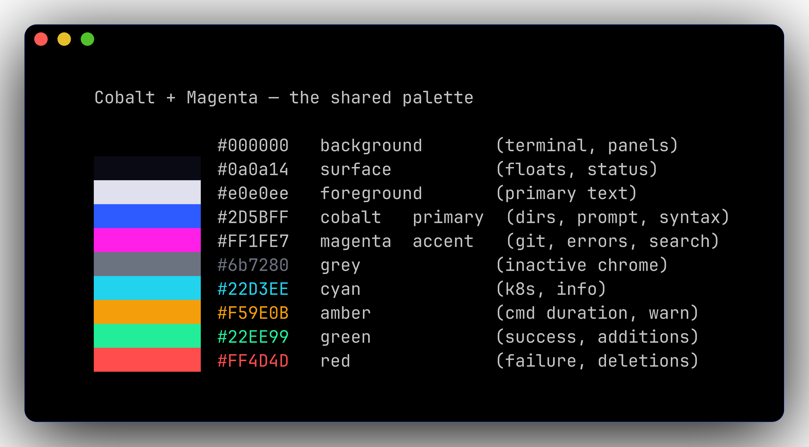

<div align="center">

# 🌃 dotfiles

**A neon-cobalt + magenta development environment for macOS.**
Themed end-to-end across nvim, tmux, starship, lazygit, fzf, bat, and ccstatusline. Reproducible from one script.

[](#)
[](https://jsgermanaai.github.io/dotfiles/palette/)
[](https://www.lazyvim.org)
[](https://starship.rs)
[](https://ohmyz.sh)



**[Live docs site →](https://jsgermanaai.github.io/dotfiles/)**

</div>

---

## Quick Start

```bash
git clone <this-repo> ~/.dotfiles
cd ~/.dotfiles
./install.sh
```

Then:

1. Set your terminal (cmux / Ghostty / iTerm2) font to **JetBrainsMono Nerd Font** (already brewed)
2. Open a fresh shell — `exec zsh`
3. Drop secrets in `~/.zshrc.local` (see [caveats](https://jsgermanaai.github.io/dotfiles/caveats/))

The installer handles symlinks, brews, oh-my-zsh, plugins, fzf bindings, tmux plugins (headless), Neovim plugins (headless), and Mason LSPs.

**[What `./install.sh` actually does, command by command →](https://jsgermanaai.github.io/dotfiles/install/)**

---

## What's inside

### 🧰 Tools

- 🐚 **zsh** + oh-my-zsh + starship
- ⚡ **fzf** + fzf-tab + zsh-autosuggestions
- 🪟 **tmux** with TPM (sessions auto-restore)
- 📝 **Neovim** (LazyVim) — Go, K8s/YAML, Docker, AI
- 🐙 **lazygit** — TUI git client
- 🤖 **CodeCompanion** — local AI via MLX or LM Studio
- 🐳 **Colima** — on-demand Docker / k8s VM, with a 🐳 prompt indicator

### 🦾 Modern CLI replacements

| Old | New | Aliases / Notes |
|-----|-----|-----------------|
| `ls` | **eza** | `ls`, `ll`, `la`, `lt`, `ltt` |
| `cat` | **bat** | `bcat`. Plain `cat` still works. Used as `MANPAGER`. |
| `grep` | **ripgrep** | `rg`. fzf uses it under the hood. |
| `find` | **fd** | sane defaults, gitignore-aware |
| `cd` | **zoxide** | `j foo` jumps; `ji` picks interactively |
| `git diff` | **delta** | wired into `gitconfig` |
| `top` | **btop** | mouse-able, GPU + thermals + processes |
| `du` | **dust** | sorted disk-usage tree |
| `man` | **tldr** | practical examples first |

---

## Color palette

The same 12-token palette is shared across every TUI surface so context-switching never breaks visual flow.

| Role | Hex | Used in |
|------|-----|---------|
| Background | `#000000` | terminal, panels, status bar |
| Surface | `#0a0a14` | floats, code blocks, raised UI |
| Active | `#1a1a3e` | nvim Visual / CursorLine |
| Foreground | `#e0e0ee` | primary text |
| **Cobalt** *(primary)* | `#2D5BFF` | dirs, prompts, keywords, k8s context |
| Cobalt-light | `#3B82F6` | hover / recessive cobalt |
| Cobalt-deep | `#0050E0` | recessive accent (mkdocs) |
| **Magenta** *(accent)* | `#FF1FE7` | git, errors, search, active borders |
| Purple | `#c0a3ff` | terraform / agents-running |
| Grey | `#6b7280` | inactive chrome, separators, time |
| Cyan | `#22D3EE` | k8s context, golang, info |
| Amber | `#F59E0B` | cmd duration, battery warn |
| Green | `#22EE99` | python venv, colima alive, vimcmd |
| Red | `#FF4D4D` | failure, battery critical |

`zsh/starship.toml` is the source of truth; nvim, tmux, lazygit, ccstatusline, fzf, mkdocs all consume the same hex values.

**[Full palette walkthrough →](https://jsgermanaai.github.io/dotfiles/palette/)**

---

## Repository layout

```
dotfiles/
├── README.md          ← you're here (short version)
├── Brewfile           ← brews + casks (fresh-machine spec)
├── install.sh         ← idempotent one-shot installer
├── macos.sh           ← macOS system defaults
├── mkdocs.yml         ← live docs site config
├── PRODUCT.md         ← strategic design context
├── DESIGN.md          ← visual system + token reference
├── docs/              ← live docs site source
├── site/              ← built docs site (deployed to GitHub Pages)
├── zsh/               ← .zshrc, .zprofile, starship.toml
├── nvim/              ← LazyVim config, plugins, colorscheme
├── tmux/              ← tmux config (loaded into ~/.tmux.conf)
├── lazygit/           ← lazygit config + theme
├── ccstatusline/      ← Claude Code statusline config
├── bat/               ← bat config
├── git/               ← git config + aliases
├── ssh/               ← ssh config (machine-local secrets in .ssh-local)
├── vim/               ← legacy vim fallback
├── scripts/           ← one-off helpers
└── .github/           ← CI for the docs deploy
```

**[Full layout walkthrough →](https://jsgermanaai.github.io/dotfiles/layout/)**

---

## Documentation

The full walkthrough lives at **[jsgermanaai.github.io/dotfiles/](https://jsgermanaai.github.io/dotfiles/)** — every section, every command, every recipe.

| Surface | Doc |
|---------|-----|
| 3-line starship prompt | [Prompt →](https://jsgermanaai.github.io/dotfiles/prompt/) |
| Modern CLI stack | [CLI →](https://jsgermanaai.github.io/dotfiles/cli/) |
| fzf shortcuts | [fzf →](https://jsgermanaai.github.io/dotfiles/fzf/) |
| LazyVim + Go + K8s + AI | [Neovim →](https://jsgermanaai.github.io/dotfiles/nvim/) |
| Local AI in nvim | [Local AI →](https://jsgermanaai.github.io/dotfiles/ai/) |
| Tmux with cobalt + magenta status bar | [Tmux →](https://jsgermanaai.github.io/dotfiles/tmux/) |
| Git workflow + delta | [Git →](https://jsgermanaai.github.io/dotfiles/git/) |
| Lazygit | [Lazygit →](https://jsgermanaai.github.io/dotfiles/lazygit/) |
| On-demand Docker / k8s via Colima | [Colima →](https://jsgermanaai.github.io/dotfiles/colima/) |
| Claude Code statusline | [ccstatusline →](https://jsgermanaai.github.io/dotfiles/ccstatusline/) |
| Install walkthrough | [Install →](https://jsgermanaai.github.io/dotfiles/install/) |
| Repository layout | [Layout →](https://jsgermanaai.github.io/dotfiles/layout/) |
| Caveats and gotchas | [Caveats →](https://jsgermanaai.github.io/dotfiles/caveats/) |

---

## Caveats highlights

A few of the gotchas worth knowing before you run `./install.sh`. The full list lives at [caveats →](https://jsgermanaai.github.io/dotfiles/caveats/).

- **Brewfile is a fresh-machine spec, not an inventory.** Manual one-off `brew install` won't be in the file. Don't run `brew bundle cleanup --force` against it.
- **Set the terminal font in the terminal app's UI.** JetBrainsMono Nerd Font is brewed but you must point your terminal at it.
- **Secrets live in `~/.zshrc.local`.** This file is gitignored. Drop Azure/AKS switchers, MLX model paths, and machine-local aliases there.
- **The Brewfile pins to Apple Silicon.** Intel Macs will install but some casks may not have arm64-only equivalents.
- **`docs-serve` runs the site locally on `:8000`.** Use it before pushing to verify the live deploy will look right.

---

## Contributing

This is a personal dotfiles repo, but if you're forking it the design system is documented:

- [`PRODUCT.md`](PRODUCT.md) — strategic context (audience, brand personality, anti-references, design principles)
- [`DESIGN.md`](DESIGN.md) — visual system (12-color palette, typography, elevation, components, do's and don'ts)
- [`DESIGN.json`](DESIGN.json) — Stitch-compatible sidecar with OKLCH canonicals, tonal ramps, and self-contained component snippets

The fonts (Satoshi for body, JetBrains Mono for code) were chosen for look and mass compatability.

---

## License

MIT. See [LICENSE](LICENSE) for the long version.

## Credits

Built on the shoulders of: [oh-my-zsh](https://ohmyz.sh), [starship](https://starship.rs), [LazyVim](https://www.lazyvim.org), [tmux](https://github.com/tmux/tmux), [TPM](https://github.com/tmux-plugins/tpm), [lazygit](https://github.com/jesseduffield/lazygit), [tokyonight.nvim](https://github.com/folke/tokyonight.nvim), [CodeCompanion.nvim](https://codecompanion.olimorris.dev), [mkdocs-material](https://squidfunk.github.io/mkdocs-material/), [Satoshi](https://www.fontshare.com/fonts/satoshi) by Indian Type Foundry, and [JetBrains Mono](https://www.jetbrains.com/lp/mono/).
