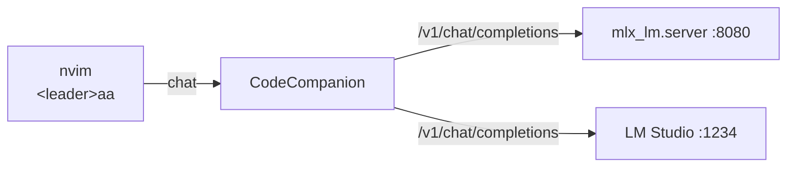

# 🤖 Local AI in Neovim

Configured via [CodeCompanion.nvim](https://codecompanion.olimorris.dev/) talking
to a **local OpenAI-compatible endpoint**. On-demand — no daemon running unless
you start it.




## Two ways to serve a model

=== "🅰️ MLX server (CLI)"

    ```bash
    # 1. Drop in ~/.zshrc.local
    export MLX_MODEL_PATH="/path/to/gemma-3-moe"

    # 2. Start the server
    mlx-start                # :8080

    # 3. Point CodeCompanion at it
    ai-use-mlx
    ```

=== "🅱️ LM Studio (GUI)"

    ```bash
    # 1. Open LM Studio app
    # 2. Load your Gemma 3 model
    # 3. Start the local server (defaults to :1234)

    # 4. Flip CodeCompanion's endpoint
    ai-use-lmstudio
    ```

## Helpers

| Command | Effect |
|---------|--------|
| `mlx-start [model]` | Launch `mlx_lm.server` on `:8080` |
| `mlx-stop` | Kill any running mlx_lm.server |
| `mlx-status` | Is it up? |
| `ai-use-mlx` | Set `$AI_LLM_URL` → `:8080` for current shell |
| `ai-use-lmstudio` | Set `$AI_LLM_URL` → `:1234` for current shell |
| `ai-status` | Print the current endpoint + ping it |


