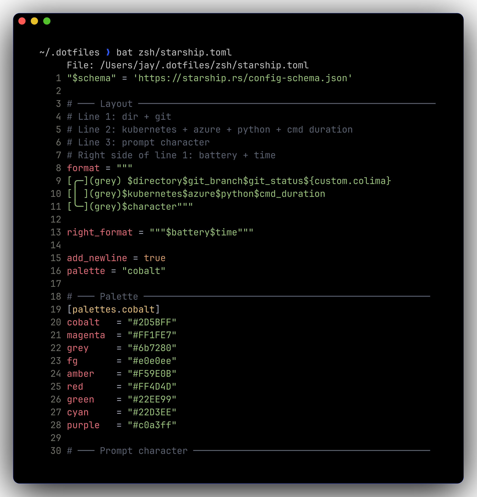
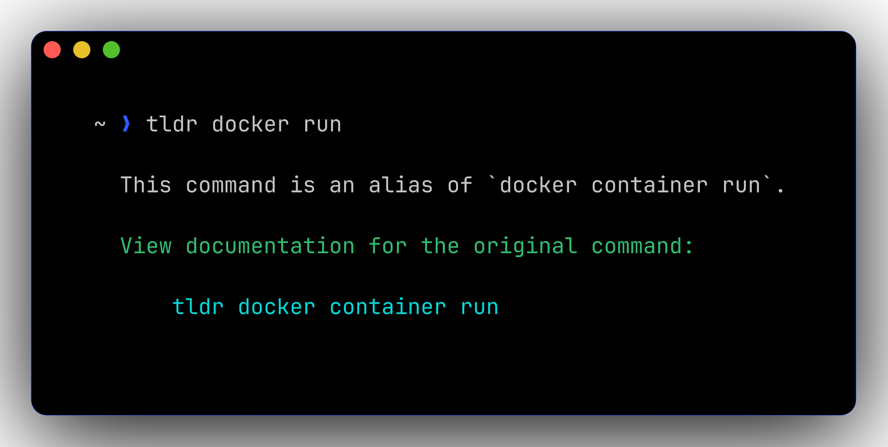

# 🦾 Modern CLI stack

Modern replacements for `ls`, `cat`, `grep`, `find`, `cd`, `top`, `du`, `man`. All themed with the cobalt + magenta palette.

| Old | New | Aliases / Notes |
|-----|-----|-----------------|
| `ls` | **eza** | `ls`, `ll`, `la`, `lt` (tree, 2-deep), `ltt` (tree, 3-deep) |
| `cat` | **bat** | `bcat`. Plain `cat` still available. Used as `MANPAGER`. |
| `grep` | **ripgrep** | `rg`. fzf uses it under the hood. |
| `find` | **fd** | sane defaults, gitignore-aware |
| `cd` | **zoxide** | `j foo` (frecent), `ji` (interactive picker) |
| `git diff` | **delta** | wired into `gitconfig` — every `git diff` is auto-formatted |
| `top` | **btop** | GPU + thermals, mouse-able |
| `du` | **dust** | tree of disk usage, sorted |
| `man` | **tldr** (tealdeer) | `tldr <cmd>` for practical examples |
| git TUI | `lg` (lazygit) | or `<leader>gg` from inside nvim |

## Screenshots

