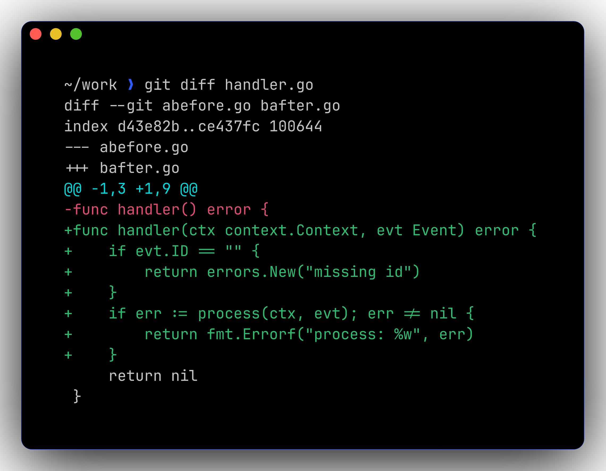

# 🐙 Git workflow

`git diff` is automatically piped through **delta** for side-by-side, syntax-highlighted diffs.



## Conventional-commit aliases

```bash
git feat -s api "add audit endpoint"     # → "feat(api): add audit endpoint"
git fix  -s ui  "stop double-rendering"  # → "fix(ui): stop double-rendering"
git chore "bump deps"                    # → "chore: bump deps"
git wip  -a "checkpoint"                 # → "wip!: checkpoint"  (! = breaking)
```

Available verbs: `feat`, `fix`, `chore`, `docs`, `style`, `refactor`, `perf`, `test`, `ci`, `build`, `rev`, `wip`.

## Multi-account identities

`includeIf` switches identity by directory:

| Directory | Identity |
|-----------|----------|
| `~/work/...` | AuditIdentity (work email) |
| `~/Code/k8s-rbac-audit-toolkit/...` | AuditIdentity |
| Everything else | Personal |

Verify with:

```bash
git-whoami
```
