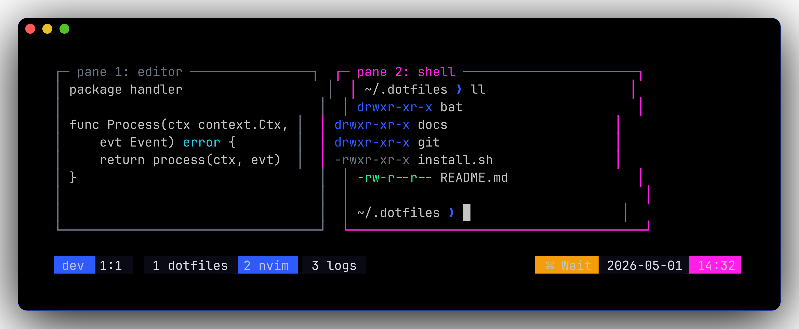
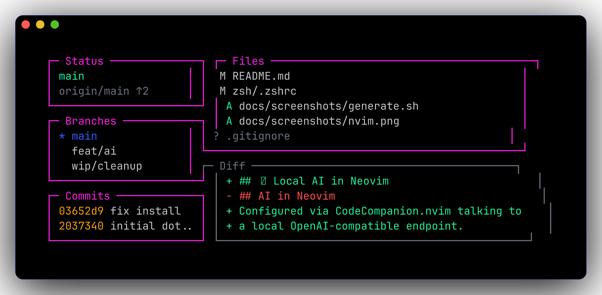
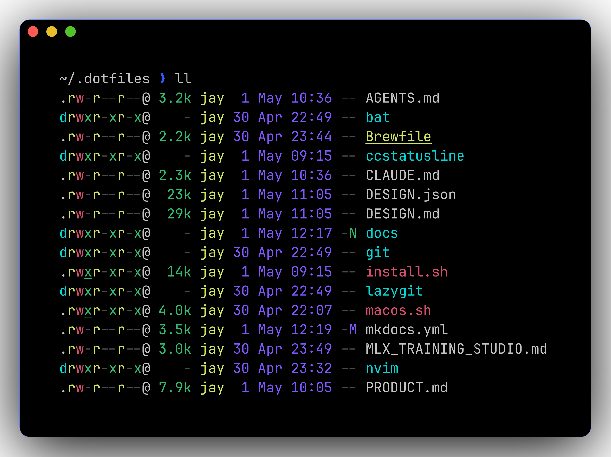
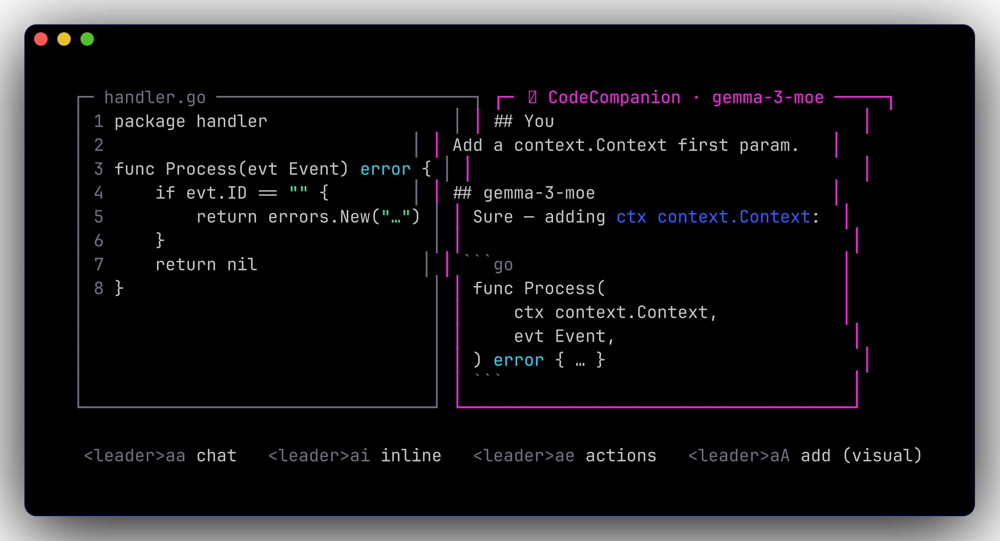

---
hide:
  - navigation
---

# 🌃 dotfiles

A neon-cobalt + magenta development environment for **macOS**. Themed end-to-end across **nvim, tmux, starship, lazygit, fzf, bat, and ccstatusline**. Reproducible from one script.
{: .cobalt-hero-tagline }

{: .cobalt-hero-palette }

```bash
git clone <this-repo> ~/.dotfiles
cd ~/.dotfiles
./install.sh
```

<div class="cobalt-tile-strip">
<a href="prompt/" class="cobalt-tile">
  
  <span class="cobalt-tile-label">/ prompt</span>
</a>
<a href="tmux/" class="cobalt-tile">
  
  <span class="cobalt-tile-label">/ tmux</span>
</a>
<a href="lazygit/" class="cobalt-tile">
  
  <span class="cobalt-tile-label">/ lazygit</span>
</a>
<a href="nvim/" class="cobalt-tile">
  
  <span class="cobalt-tile-label">/ nvim</span>
</a>
</div>

## What's inside

=== "🧰 Tools"

    - 🐚 **zsh** + oh-my-zsh + starship
    - ⚡ **fzf** + fzf-tab + zsh-autosuggestions
    - 🪟 **tmux** with TPM (sessions auto-restore)
    - 📝 **Neovim** (LazyVim) — Go, K8s/YAML, Docker, AI
    - 🐙 **lazygit** — TUI git client
    - 🤖 **CodeCompanion** — local AI via MLX or LM Studio
    - 🐳 **Colima** — on-demand Docker/k8s VM, with a 🐳 prompt indicator

=== "🦾 Modern CLI"

    | Old | New | Aliases / Notes |
    |-----|-----|-----------------|
    | `ls` | **eza** | `ls`, `ll`, `la`, `lt`, `ltt` |
    | `cat` | **bat** | `bcat`. Plain `cat` still works. |
    | `grep` | **ripgrep** | `rg`. fzf uses it under the hood. |
    | `find` | **fd** | sane defaults, gitignore-aware |
    | `cd` | **zoxide** | `j foo` jumps; `ji` picks |
    | `git diff` | **delta** | wired into gitconfig |
    | `top` | **btop** | mouse-able, GPU + thermals |
    | `du` | **dust** | sorted disk-usage tree |
    | `man` | **tldr** | practical examples first |

## Where to next

<div class="cobalt-cards">
<a href="prompt/" class="cobalt-card">
  
  <div class="cobalt-card-body">
    <span class="cobalt-card-title">Prompt</span>
    <span class="cobalt-card-hook">Every starship segment, what it shows, how to enable each.</span>
  </div>
</a>
<a href="cli/" class="cobalt-card">
  
  <div class="cobalt-card-body">
    <span class="cobalt-card-title">CLI stack</span>
    <span class="cobalt-card-hook">Modern replacements for ls, cat, grep, find, cd, top, du, man.</span>
  </div>
</a>
<a href="fzf/" class="cobalt-card">
  <span class="cobalt-card-stub">fzf</span>
  <div class="cobalt-card-body">
    <span class="cobalt-card-title">fzf shortcuts</span>
    <span class="cobalt-card-hook">Fuzzy file picker, history search, cd jump, tab completion.</span>
  </div>
</a>
<a href="palette/" class="cobalt-card">
  
  <div class="cobalt-card-body">
    <span class="cobalt-card-title">Palette</span>
    <span class="cobalt-card-hook">12 canonical tokens shared across every TUI surface.</span>
  </div>
</a>
<a href="nvim/" class="cobalt-card">
  
  <div class="cobalt-card-body">
    <span class="cobalt-card-title">Neovim</span>
    <span class="cobalt-card-hook">LazyVim base, TokyoNight Storm forced to pure black + cobalt + magenta.</span>
  </div>
</a>
<a href="ai/" class="cobalt-card">
  
  <div class="cobalt-card-body">
    <span class="cobalt-card-title">Local AI</span>
    <span class="cobalt-card-hook">CodeCompanion in nvim, talking to MLX server or LM Studio.</span>
  </div>
</a>
<a href="tmux/" class="cobalt-card">
  
  <div class="cobalt-card-body">
    <span class="cobalt-card-title">Tmux</span>
    <span class="cobalt-card-hook">Cobalt + magenta status bar, sessions auto-resurrect.</span>
  </div>
</a>
<a href="git/" class="cobalt-card">
  
  <div class="cobalt-card-body">
    <span class="cobalt-card-title">Git workflow</span>
    <span class="cobalt-card-hook">Conventional-commit aliases, delta side-by-side diffs.</span>
  </div>
</a>
<a href="lazygit/" class="cobalt-card">
  
  <div class="cobalt-card-body">
    <span class="cobalt-card-title">Lazygit</span>
    <span class="cobalt-card-hook">TUI git client, magenta active border, cobalt directory listings.</span>
  </div>
</a>
<a href="colima/" class="cobalt-card">
  <span class="cobalt-card-stub">colima</span>
  <div class="cobalt-card-body">
    <span class="cobalt-card-title">Colima</span>
    <span class="cobalt-card-hook">On-demand Docker + k8s, with a 🐳 indicator in the prompt.</span>
  </div>
</a>
<a href="ccstatusline/" class="cobalt-card">
  <span class="cobalt-card-stub">ccstatus</span>
  <div class="cobalt-card-body">
    <span class="cobalt-card-title">ccstatusline</span>
    <span class="cobalt-card-hook">Powerline statusline for Claude Code, palette-themed.</span>
  </div>
</a>
<a href="install/" class="cobalt-card">
  <span class="cobalt-card-stub">install.sh</span>
  <div class="cobalt-card-body">
    <span class="cobalt-card-title">Install</span>
    <span class="cobalt-card-hook">What ./install.sh actually does, command by command.</span>
  </div>
</a>
<a href="layout/" class="cobalt-card">
  <span class="cobalt-card-stub">tree</span>
  <div class="cobalt-card-body">
    <span class="cobalt-card-title">Layout</span>
    <span class="cobalt-card-hook">Repository structure, what symlinks where.</span>
  </div>
</a>
<a href="caveats/" class="cobalt-card">
  <span class="cobalt-card-stub">⚠</span>
  <div class="cobalt-card-body">
    <span class="cobalt-card-title">Caveats</span>
    <span class="cobalt-card-hook">What you'll trip over installing this.</span>
  </div>
</a>
</div>
