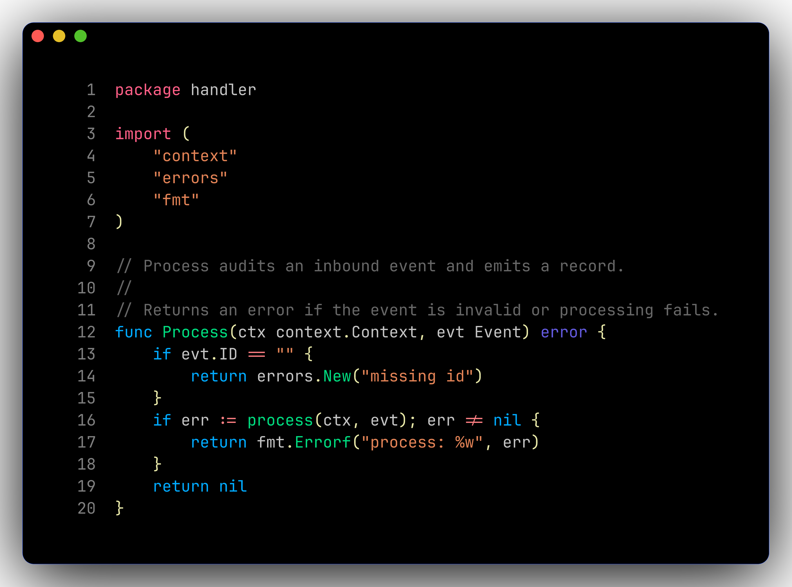

# 📝 Neovim

LazyVim base, customised for **Go + Kubernetes**, themed with TokyoNight Storm
overridden to **pure black + cobalt + magenta**.

## Keybindings (additions to LazyVim defaults)

| Keys | Action |
|------|--------|
| ++leader+"g"+"g"++ | lazygit (floating) |
| ++leader+"g"+"r"++ | `:GoRun` |
| ++leader+"g"+"t"++ | `:GoTest` |
| ++leader+"g"+"shift+t"++ | `:GoTestFile` |
| ++leader+"g"+"c"++ | `:GoCoverage` |
| ++leader+"g"+"shift+i"++ | `:GoImports` |
| ++leader+"g"+"s"++ | `:GoFillStruct` |
| ++leader+"g"+"e"++ | `:GoIfErr` |
| ++leader+"y"+"s"++ | YAML schema picker (k8s, GH actions, etc.) |
| ++leader+"a"+"a"++ / ++leader+"a"+"i"++ / ++leader+"a"+"e"++ / ++leader+"a"+"shift+a"++ | AI chat / inline / actions / add-to-chat *(visual)* |
| ++leader+"s"++ / ++leader+"s"+"w"++ / ++leader+"s"+"p"++ | Spectre search & replace |
| ++ctrl+"backslash"++ | toggleterm float |
| ++ctrl+"h"++ / ++ctrl+"j"++ / ++ctrl+"k"++ / ++ctrl+"l"++ (in terminal) | jump out of terminal pane |
| ++alt+"j"++ / ++alt+"k"++ | move line down/up |

## LSPs/formatters auto-installed by Mason

`gopls` · `gofumpt` · `goimports` · `golangci-lint` · `golines` · `gotests` · `gotestsum` · `yaml-language-server` · `lua-language-server` · `stylua` · `bash-language-server` · `shellcheck` · `shfmt`

## Theme overrides

The TokyoNight palette overrides live in
[`nvim/lua/plugins/colorscheme.lua`](https://github.com/your-user/dotfiles/blob/main/nvim/lua/plugins/colorscheme.lua).
Tune cobalt/magenta intensity in the `on_colors` callback.
