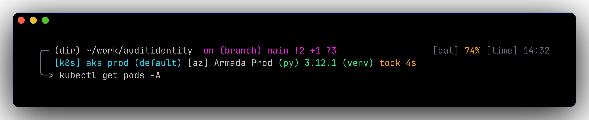
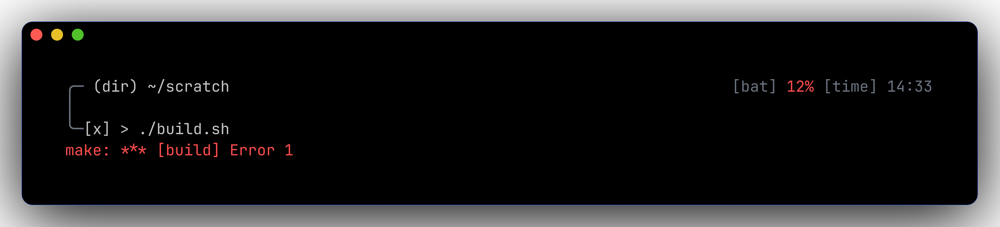

# 💎 Prompt — full reference

A 3-line cobalt + magenta starship prompt with right-aligned battery + clock.
Every segment is contextual: it only shows when it has something useful to say.





## Anatomy

```
┌── Line 1 ─────────────────────────────────────────────────────┐
╭─  ~/work/dotfiles   on   main !8 ?15           🐳   [bat]  [time]
   │                  │    │                      │      │     │
   │                  │    └─ git_branch + status │      │     └─ time
   │                  └─ "on" literal             │      └─ battery
   │                                              └─ colima (🐳 if running)
   └─ directory
┌── Line 2 ─────────────────────────────────────────────────────┐
│  ⎈ aks-prod (default)  󰠅 Armada-Prod   3.12.1 (venv)  took 4s
│   │                    │              │              │
│   └─ kubernetes        │              │              └─ cmd_duration
│                        │              └─ python
│                        └─ azure
┌── Line 3 ─────────────────────────────────────────────────────┐
╰─❯
   └─ character
```

## Segment reference & toggles

### ✅ Active segments

| Segment | Trigger | Visual | Disable |
|---------|---------|--------|---------|
| `directory` | always | cobalt path, truncated to 4 components |  remove `$directory` from `format` |
| `git_branch` | inside any git repo | magenta ` <branch>` | `[git_branch] disabled = true` |
| `git_status` | dirty repo | `!N` modified, `+N` staged, `?N` untracked, `⇡N`/`⇣N` ahead/behind | `[git_status] disabled = true` |
| `kubernetes` | dir contains `k8s/` or `Chart.yaml` | cyan `⎈ <ctx> (<ns>)` | `[kubernetes] disabled = true` |
| `azure` | logged into az cli | bold cobalt `󰠅 <subscription>` | `[azure] disabled = true` |
| `python` | python project markers | green ` <ver> (<venv>)` | `[python] disabled = true` |
| `cmd_duration` | last cmd > 2s | amber `took 4s` | `[cmd_duration] min_time = 99999999` |
| `character` | always | cobalt `❯` / magenta `✗ ❯` / green `❮` (vim) | always required |
| `battery` | macOS / laptops | colour-coded percent | `[battery] disabled = true` |
| `time` | always | grey `HH:MM` | `[time] disabled = true` |
| `custom.colima` | colima VM running | green `🐳` | `[custom.colima] disabled = true` |

### 🟡 Pre-configured but dormant (flip `disabled` and add to `format`)

`nodejs` · `golang` · `terraform` · `username` · `hostname`

### 🔴 Off-by-default

`aws` · `gcloud` · `docker_context` · `package` · `jobs` · `memory_usage` · `os` · `shell` · 50+ language modules

Full list: <https://starship.rs/config/>

## Adding / removing segments

The `format` field in `zsh/starship.toml` controls what renders and where:

```toml
format = """
[╭─](grey) $directory$git_branch$git_status${custom.colima}
[│ ](grey)$kubernetes$azure$python$cmd_duration
[╰─](grey)$character"""

right_format = """$battery$time"""
```

Add a segment by inserting `$<name>` (or `${custom.<name>}` for custom modules)
in the desired position. Remove by deleting it. Changes take effect on next shell.

## Recipes

??? example "Hide the time / battery"
    ```toml
    right_format = ""               # remove both
    right_format = """$battery"""   # keep battery only
    ```

??? example "Make it a one-line prompt"
    ```toml
    format = """$directory$git_branch$git_status$kubernetes$azure$python$cmd_duration$character"""
    ```

??? example "Always show full directory (no truncation)"
    ```toml
    [directory]
    truncation_length = 0
    truncate_to_repo = false
    ```

??? example "Show k8s context everywhere (not just in k8s dirs)"
    ```toml
    [kubernetes]
    detect_files = []
    detect_folders = []
    ```

??? example "Add Go version when in a Go project"
    ```toml
    [│ ](grey)$kubernetes$azure$golang$python$cmd_duration
    ```

??? example "Add AWS profile / region"
    ```toml
    [aws]
    disabled = false
    format = "[ $symbol($profile)(@$region)]($style) "
    symbol = " "
    style  = "bold amber"
    ```
    Then `[│ ](grey)$kubernetes$azure$aws$python$cmd_duration` in `format`.

??? example "Make slow commands warn loudly"
    ```toml
    [cmd_duration]
    min_time = 500
    format   = "[took $duration ⚠]($style) "
    style    = "bold red"
    ```

??? example "Disable starship entirely (back to oh-my-zsh)"
    Comment out `eval "$(starship init zsh)"` in `~/.zshrc`.
